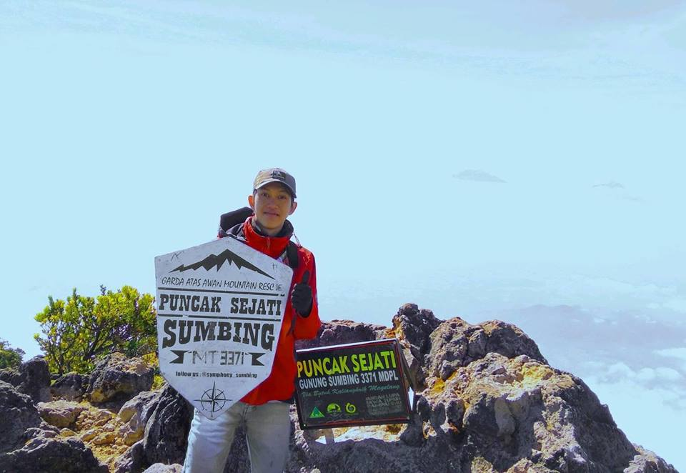

Saya merupakan seorang lelaki beruntung kelahiran Banyumas, 30 Januari dengan nama asli Razaqul Akli Tegar Ardiansyah. Lulusan Rekayasa Perangkat Lunak di salah satu sekolah kejuruan negeri yang ada di Purwokerto, dan sekarang saya bekerja di [PT. PuskoMedia Indonesia Kreatif](https://www.puskomedia.id/) sebagai Full Stack Developer.

Selain bekerja, saya juga kerap berkegiatan alam terbuka dan sesekali menangkap gerak dengan kamera ponselnya.

### Sosial Media

* Email: [myrazaqul@gmail.com](mailto:myrazaqul@gmail.com)
* GitHub: [razaqultegar](https://github.com/razaqultegar)
* Twitter: [razaqultegar](https://twitter.com/razaqultegar)

## Sedang Menggunakan

* **Laptop:**  Acer Aspire E 14 (Intel® Core™ i3, Intel® HD Graphics 4400, 6 GB DDR3 Memory, dan 500 GB HDD)
* **Hosting:**  [Netlify](https://netlify.com/),  [Puskomedia Indonesia](https://www.puskomedia.id/)
* **Static Site Generator:**  [Gatsby](https://gatsbyjs.org/)
* **Daftar tool yang saya pakai bisa di lihat** [**disini**](/tool/)
